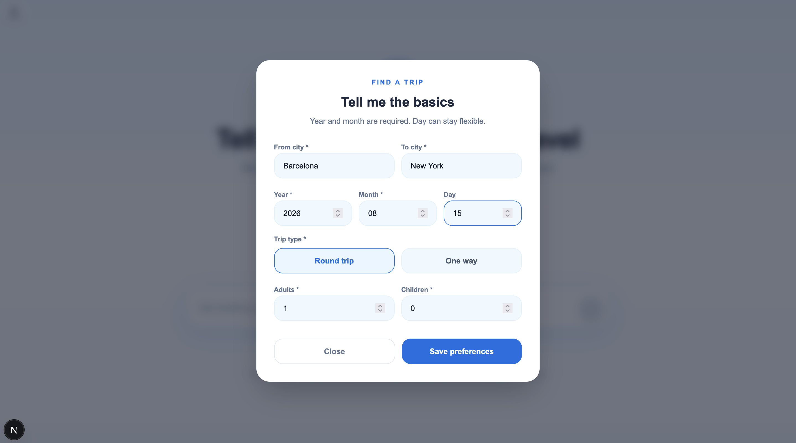
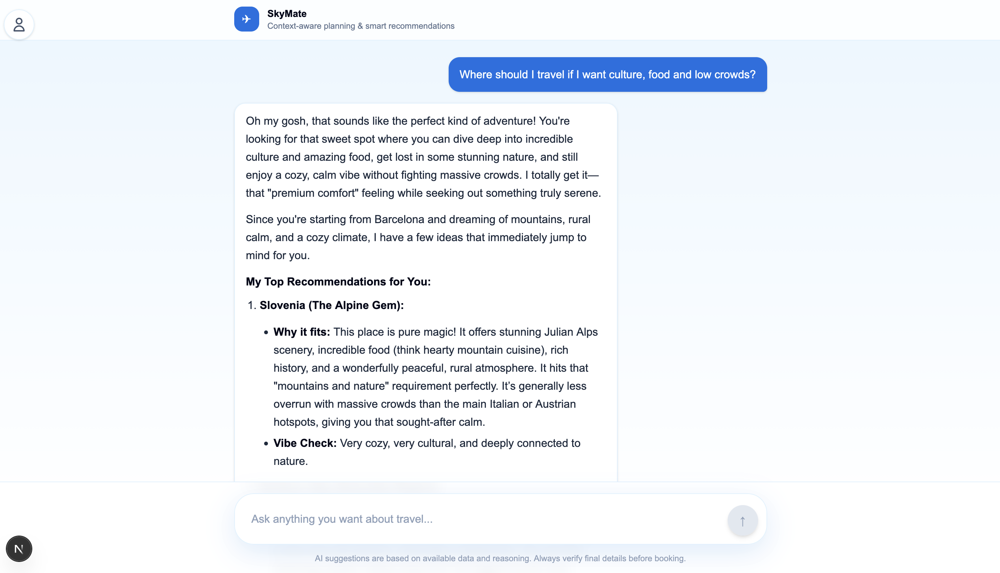

# SkyMate 
> Not just where to go.  
> **Understand why you want to travel.**

<br>

## Overview

SkyMate is a AI-powered travel assistant built during **HackUPC 2026** for the **Skyscanner Challenge**.

In a world with infinite travel options, users don’t struggle with lack of information, they struggle with **decision-making**.

SkyMate solves this by combining:

- **Intent-aware AI**
- **Agentic LLM (Gemma via Ollama)**
- **Real-time Skyscanner data**
- **Interactive user context collection**

Instead of just showing flights, SkyMate helps users:
- Understand what they actually want
- Explore meaningful options
- Make confident travel decisions

<br>

## Screenshots

### Home 


### Form



### Chat


<br>

## Installation & Local Setup

### 1. Clone the repository
```bash
git clone https://github.com/MaxVilaRuiz/SkyMate.git
cd SkyMate
```

### 2. Frontend (Next.js)
```bash
cd apps/web
npm install
npm run dev
```

### 3. Backend (FastAPI)
```bash
cd apps/api
python3 -m venv .venv
source .venv/bin/activate
pip install -r requirements.txt

uvicorn main:app --reload
```

### 4. Ollama (LLM)

**Install Ollama:**
```bash
brew install ollama
```

**Run model:**
```bash
ollama run gemma
```

### Environment variables

**Create .env in apps/api:**
```bash
# Skyscanner API (if needed)
SKYSCANNER_API_KEY=your_key

# Backend config
PORT=8000
```

<br>

## Team & Credits

- [Max Vilà Ruiz](https://github.com/MaxVilaRuiz)
- [Pau Martínez Franch](https://github.com/taopaipau)
- [Max Gimeno Giro](https://github.com/Max-Gimeno-G)
- [Aarón Quintanilla](https://github.com/aaronqintanilla)

<br>

## License

This project is licensed under the [Apache 2.0](https://choosealicense.com/licenses/apache-2.0/) © License.